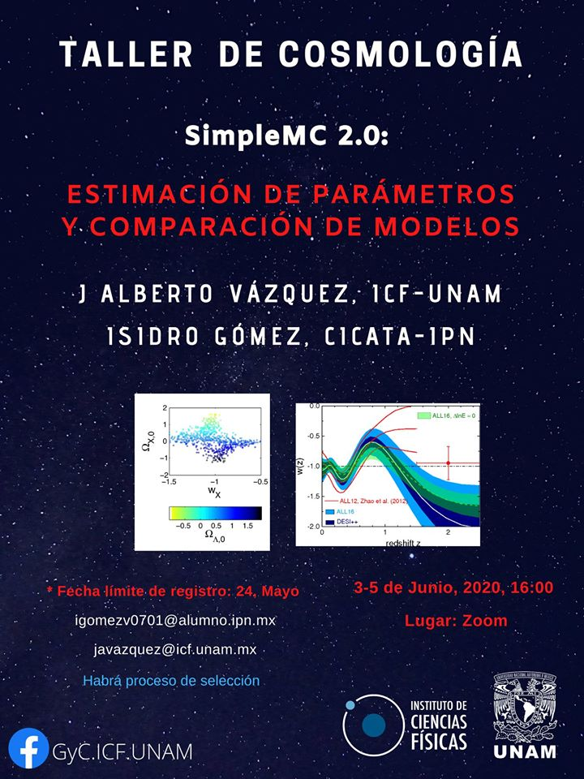

Material para el "Taller de Cosmología con SimpleMC" llevado a cabo del 3 al 5 de Junio, 2020.

----------------

**Contenido del Taller**

- Día 1. 
	- Introducción a la cosmología observacional.
	- Introducción a ``SimpleMC``.
	- Estimación de parámetros.

- Día 2.
	- Graficación de resultados
	- Comparación de constricciones de parámetros entre diferentes observaciones.
	- Agregar datos.
	- Comparación de modelos.

- Día 3. 
	- Diferencias entre samplers.
    - Comparación de modelos.
    - Conclusiones recomendaciones.

-------------------

**Contenido del directorio**

- ``Day 1 - TallerSimpleMC.pdf``.- Diapositivas del día 1. 

- ``testTaller.py``.- Script de prueba para ver si se instaló correctamente ``SimpleMC``. 

- ``Day 2 - Taller SimpleMC.ipynb``.- Notebook correspondiente al segundo día del taller. 

- ``Day 3 - Taller SimpleMC.ipynb``.- Notebook correspondiente al tercer día del taller.

---------------------

**Cartel del evento**

